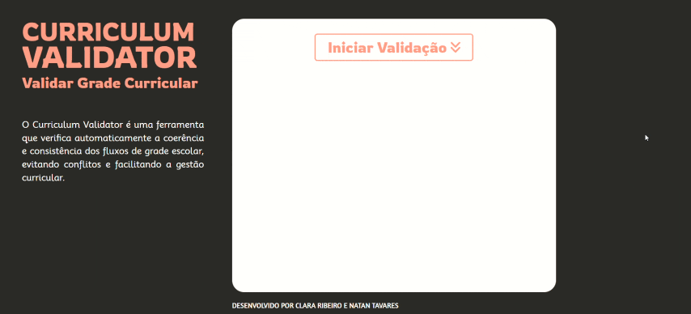
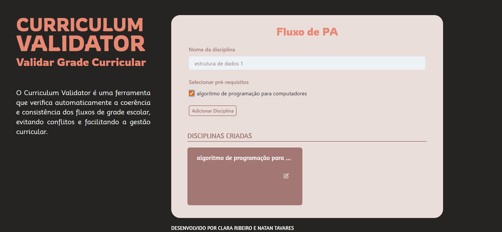
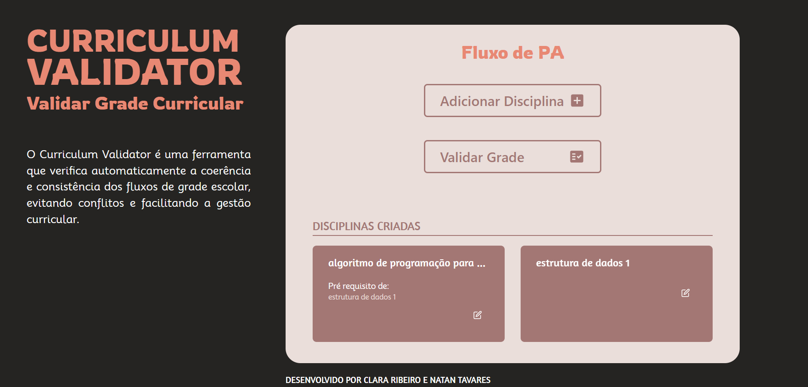
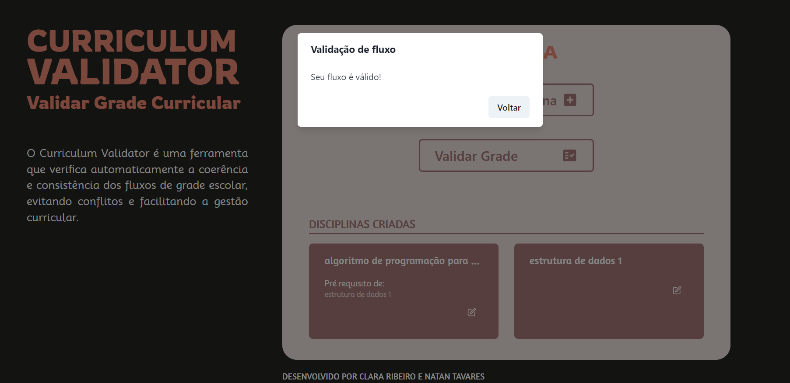

# ValidadorFluxograma

**Conteúdo da Disciplina**: Grafos 1<br>

## Alunos
|Matrícula | Aluno |
| -- | -- |
| 20/0025449  |  Natan Tavares Santana |
| 20/0036351  |  Clara Marcelino Ribeiro de Sousa |

## Sobre 
O Validador de Fluxograma é um sistema web que possui o objetivo de avaliar se a grade curricular que o usuário fornecer é válida ou não. Caso haja algum ciclo de pré-requisitos, o sistema irá avisar que o fluxograma não é válido pois há um paradoxo.

Mais detalhes do funcionamento do projeto e dos algoritmos aplicados foram explicados nesse [vídeo](https://youtu.be/O7VKb-4Gdy0)!

O Arquivo do vídeo também se encontra disponível nesse repositório:


https://github.com/projeto-de-algoritmos/Grafos1_ValidadorFluxograma/assets/64803935/57a72f4c-db4a-4d98-83f9-dfaa3b0b33b1


O protótipo da aplicação foi realizado pelo Figma e pode ser acessado [aqui](https://www.figma.com/proto/gir2PsBWd8JVqQi1xqW2YH/CurriculumValidator?type=design&node-id=5-3&t=y7xUuQouCkwMrvjU-1&scaling=scale-down&page-id=0%3A1&mode=design).

## Screenshots
Fluxo Válido:
<br/><br/>

Fluxo Inválido:
<br/><br/>

Screenshots:
<br/>
<br/>
<br/>

## Instalação 
**Linguagem**: JavaScript<br>
**Framework**: ReactJs<br>

Passos para rodar o projeto:

1 - entrar na pasta 'curriculum-validator'

```cd curriculum-validator ```

2 - Instalar as dependências

```npm install ```

3 - Rodar aplicação React

```npm run start ```

## Uso 
A aplicação possui um fluxo bastante claro e intuitivo. Para conseguir validar a grade curricular, você deverá inserir o nome do fluxo a adicionar as disciplinas da grade. Após isso basta selecionar Validar Grade.


